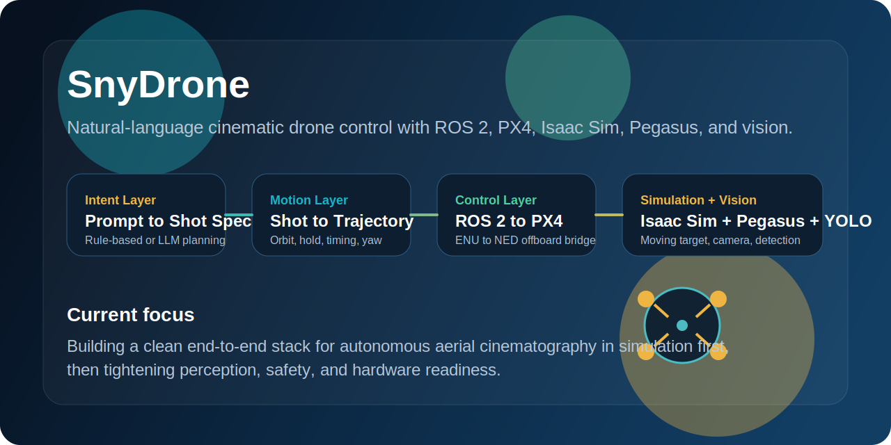
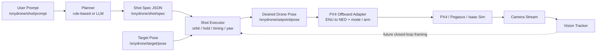
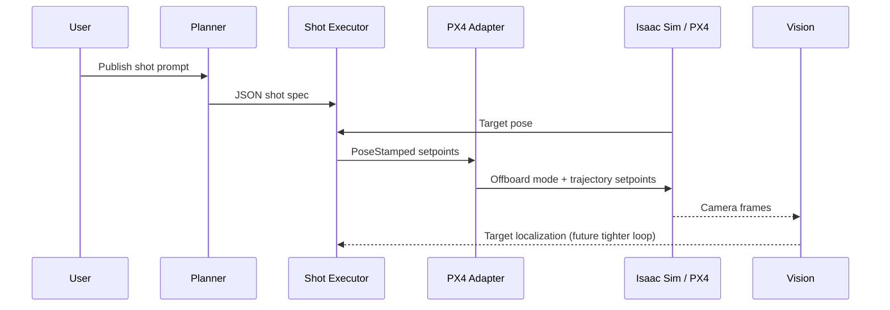

# SnyDrone

<p align="center">
  
</p>

<p align="center">
  <a href="https://www.python.org/"></a>
  <a href="https://docs.ros.org/en/humble/index.html"></a>
  <a href="https://px4.io/"></a>
  <a href="https://developer.nvidia.com/isaac/sim"></a>
  <a href="https://pegasussimulator.github.io/PegasusSimulator/"></a>
  
</p>

SnyDrone is an autonomous aerial cinematography stack that turns natural-language shot requests into simulated drone motion. It combines ROS 2, PX4 offboard control, Isaac Sim, Pegasus, and onboard vision to explore a simple idea:

**tell the drone what shot you want, and let the system plan and execute it.**

The repo is now organized as a cleaned project workspace, not a giant machine-local dump. It contains the first-party ROS 2 packages, simulation entry points, and helper scripts that make up the real SnyDrone system.

## Why This Exists

Most drone software stacks are built around navigation, mapping, or low-level autonomy. SnyDrone is about **camera intent**.

Instead of manually flying waypoints to capture a nice orbit, reveal, or follow shot, the goal is to let a user say something like:

```text
orbit the target at 4 meters radius, 3 meters high, for 12 seconds
```

SnyDrone then:

- interprets the request into a structured shot specification,
- generates time-varying pose setpoints around a target,
- converts those setpoints into PX4 offboard commands,
- and executes the motion in simulation with a camera-equipped drone.

That makes this project interesting as a robotics system, a human-drone interaction system, and a creative AI interface.

## What It Does Right Now

The current workspace already implements the main autonomy loop:

- prompt ingestion on `/snydrone/shot/prompt`
- rule-based or LLM-backed shot planning to `/snydrone/shot/spec`
- shot execution into `/snydrone/setpoint/pose`
- ROS 2 to PX4 offboard bridging with ENU to NED conversion
- Isaac Sim scene startup with Pegasus and PX4 backend wiring
- moving target publication on `/snydrone/target/pose`
- monocular onboard camera publishing
- YOLO-based detection for target localization and future closed-loop tracking

In short, the system already demonstrates:

`natural language -> shot spec -> pose setpoints -> PX4 offboard control -> cinematic motion in sim`

## Architecture



## Repo Layout

```text
.
├── assets/
│   └── readme/
│       └── hero.svg
├── ros2_ws/
│   └── src/
│       ├── px4_msgs/
│       ├── snydrone_brain/
│       ├── snydrone_bringup/
│       ├── snydrone_px4/
│       ├── snydrone_shots/
│       ├── snydrone_topic_tools/
│       └── snydrone_vision/
├── snydrone_sim/
│   └── run_isaac.py
├── list_prims.py
├── test_cam.py
└── test_og.py
```

## Core Packages

### `snydrone_brain`

High-level planning and shot execution.

- `shot_planner_node.py`: rule-based natural-language parsing
- `llm_planner_node.py`: Anthropic-backed prompt-to-JSON planner
- `shot_executor_node.py`: generates live pose setpoints from the shot spec and target pose

### `snydrone_px4`

The ROS 2 to PX4 bridge.

- `px4_offboard_adapter_node.py`: converts `PoseStamped` setpoints into PX4 `TrajectorySetpoint`, publishes `OffboardControlMode`, and can auto-arm / enter offboard mode

### `snydrone_shots`

Shot and visualization utilities.

- `target_pose_node.py`: fixed target publisher for early testing
- `orbit_shot_node.py`: direct orbit primitive
- `path_trail_node.py`: publishes a path trail for setpoint visualization

### `snydrone_vision`

Perception layer.

- `tracker_node.py`: YOLO / YOLO-World based target detection from the drone camera stream, publishing normalized image-space target location

### `snydrone_topic_tools`

Topic wiring helpers.

- `image_relay_node.py`: relays image and camera info topics into the SnyDrone naming scheme

### `snydrone_bringup`

Launch entry points.

- `snydrone_core.launch.py`: starts the planner, shot executor, and PX4 bridge together

## Runtime Flow



## Workspace Setup

This repository intentionally does **not** vendor your local Isaac Sim install, PX4 clone, or Pegasus checkout. Those are too large and too machine-specific for GitHub. The repo holds the project code; external simulators and toolchains should be installed separately on the machine that runs the stack.

At a high level, you need:

- ROS 2 Humble
- PX4 Autopilot available locally
- Isaac Sim installed locally
- Pegasus Simulator available locally
- Python dependencies for Ultralytics and Anthropic if you use those nodes

## Quick Start

Build the ROS 2 workspace:

```bash
cd ros2_ws
source /opt/ros/humble/setup.bash
colcon build
source install/setup.bash
```

Launch the Isaac Sim scene:

```bash
python3 snydrone_sim/run_isaac.py
```

In another terminal, launch the main control stack:

```bash
cd ros2_ws
source /opt/ros/humble/setup.bash
source install/setup.bash
ros2 launch snydrone_bringup snydrone_core.launch.py
```

Publish a shot request:

```bash
ros2 topic pub /snydrone/shot/prompt std_msgs/msg/String "{data: 'orbit the target at 4 meter radius, 3 meters high, for 12 seconds'}" --once
```

## Visuals

The simulation setup is a warehouse-style Isaac Sim environment with a Pegasus multirotor, PX4 backend integration, a moving subject, and an onboard camera. The repo includes a generated project graphic right now; adding raw simulator captures and short clips is the next easy upgrade for this section.

Suggested visuals to keep in this repo:

- simulator viewport screenshot
- annotated camera frame from the tracker
- RViz or path visualization showing the generated orbit
- short GIF of the drone executing a shot

## What Has Been Built

- modular ROS 2 package separation instead of one monolithic node
- a real PX4 offboard adapter with coordinate-frame conversion
- a live shot executor that consumes structured shot JSON
- a simulation entry point that instantiates the drone, target, and camera pipeline
- a vision tracker using YOLO-based target detection
- a bringup package for the core runtime loop

This is no longer just a placeholder architecture. The codebase contains the main pieces of a working simulation-first aerial cinematography system.

## Current Limitations

- the primary tested path is simulation, not hardware
- the shot vocabulary is still intentionally small
- the LLM planner depends on `CLAUDE_API_KEY`
- perception is not yet tightly closed into the control loop
- several package metadata fields still need cleanup
- setup is still research-project style rather than one-command polished

## Roadmap

- add more shot primitives such as reveal, follow, push-in, and pull-away
- close the loop between vision output and shot execution
- improve launch orchestration for full-stack startup
- add reproducible setup instructions for PX4, Pegasus, and Isaac Sim
- add safety constraints and better motion planning
- mature the stack toward real-aircraft testing

## Why This Repo Looks Different Now

The original GitHub repo was just a scaffold README and placeholder package layout. This version reflects the actual workspace:

- real source packages copied from the working local project
- giant local installs excluded
- generated artifacts ignored
- README rewritten to explain the real system rather than a template

## Summary

SnyDrone is a robotics and creative-autonomy project focused on one clear goal: making drones understand cinematic intent. If you are interested in autonomous filming, language-guided robotics, or simulation-first aerial systems, this repo is the foundation for that work.
