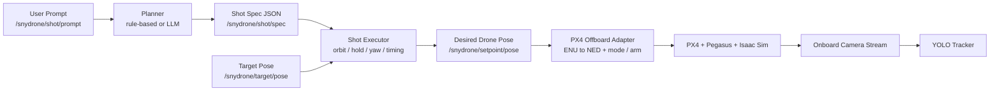
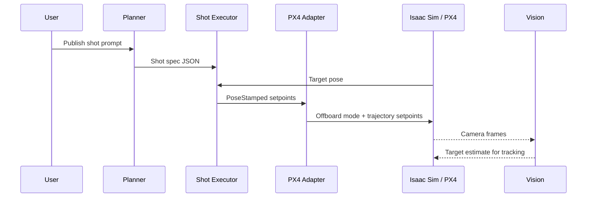

# snydrone

<p align="center">
  <a href="https://www.python.org/"></a>
  <a href="https://docs.ros.org/en/humble/index.html"></a>
  <a href="https://px4.io/"></a>
  <a href="https://developer.nvidia.com/isaac/sim"></a>
  <a href="https://pegasussimulator.github.io/PegasusSimulator/"></a>
  
</p>

snydrone is an autonomous aerial cinematography project built with ROS 2, PX4 offboard control, Isaac Sim, Pegasus, and onboard vision. The goal is to let a user describe a camera shot in natural language and have the drone plan and execute that shot around a target in simulation.

This project focuses on cinematic intent rather than raw waypoint following. Instead of manually flying an orbit or reveal, snydrone translates a prompt such as:

```text
orbit the target at 4 meters radius, 3 meters high, for 12 seconds
```

into a structured shot specification, generates a trajectory around the subject, and sends the resulting commands through a PX4 offboard pipeline.

## Research Focus

snydrone explores a robotics question that is usually left to human pilots and camera operators:

**can a drone understand cinematic intent and translate it into controllable motion around a subject?**

The project treats aerial filming as a full-stack autonomy problem that combines:

- human-language input
- shot representation
- trajectory generation
- flight control
- simulation
- perception

Rather than optimizing only for navigation accuracy, snydrone is built around shot structure, framing, and target-relative motion.

## Project Overview

The system is split into clear layers:

- a planner that converts prompt text into shot parameters
- a shot executor that turns those parameters into pose setpoints
- a PX4 bridge that converts ROS 2 poses into PX4 trajectory commands
- a simulation layer that provides the drone, target, and camera stream
- a vision layer that detects and localizes the target from onboard imagery

That gives the project an end-to-end flow:

`natural language -> shot spec -> trajectory setpoints -> PX4 offboard control -> simulated drone motion`

## System Architecture



## What I Built

The repository includes the core pieces needed to demonstrate autonomous cinematic flight in simulation:

- a prompt-driven planning layer with both rule-based and LLM-backed options
- a shot execution node that produces live pose setpoints around a target
- a PX4 offboard adapter that handles coordinate conversion and setpoint publishing
- a simulation entry point that launches the drone, target, environment, and camera pipeline
- a vision tracker that runs YOLO or YOLO-World to estimate target location from the drone camera
- a bringup package that launches the main control loop

The current implementation already supports the main idea of the project: describing a shot at a high level and converting that description into drone motion.

## Key Contributions

This work brings together several pieces that are often developed separately:

- a natural-language interface for cinematic shot requests
- a structured shot representation that can be consumed by downstream control nodes
- a target-relative trajectory generation pipeline for orbit-style filming
- a ROS 2 to PX4 offboard bridge for simulated drone execution
- a perception module that estimates target location from the onboard camera feed
- a simulation environment that makes the full pipeline testable end to end

Taken together, these components make snydrone a compact research platform for autonomous aerial cinematography.

## Runtime Flow



## Workspace Layout

```text
.
├── ros2_ws/
│   └── src/
│       ├── px4_msgs/
│       ├── snydrone_brain/
│       ├── snydrone_bringup/
│       ├── snydrone_px4/
│       ├── snydrone_shots/
│       ├── snydrone_topic_tools/
│       └── snydrone_vision/
├── snydrone_sim/
│   └── run_isaac.py
```

## Package Breakdown

### `snydrone_brain`

This package contains the planning and execution logic.

- `shot_planner_node.py` parses simple natural-language prompts into structured shot JSON.
- `llm_planner_node.py` uses Anthropic to generate a stricter shot specification from free-form language.
- `shot_executor_node.py` consumes the shot spec and target pose and publishes the desired drone pose at runtime.

### `snydrone_px4`

This package connects the planner output to PX4.

- `px4_offboard_adapter_node.py` listens for `PoseStamped` setpoints, converts them from ENU to NED, and publishes PX4 offboard messages and trajectory setpoints.

### `snydrone_shots`

This package contains shot utilities and trajectory helpers.

- `target_pose_node.py` publishes a target pose for testing.
- `orbit_shot_node.py` generates a direct orbit around the target.
- `path_trail_node.py` publishes a `Path` message for visualizing generated setpoints.

### `snydrone_vision`

This package contains the perception layer.

- `tracker_node.py` runs YOLO-based detection on the drone camera stream and publishes normalized target coordinates plus annotated images.

### `snydrone_topic_tools`

This package contains topic adapters.

- `image_relay_node.py` relays image and camera info topics into the naming scheme used by the rest of the system.

### `snydrone_bringup`

This package launches the core runtime.

- `snydrone_core.launch.py` starts the planner, shot executor, and PX4 bridge.

## Simulation

The simulation scene is launched from `snydrone_sim/run_isaac.py`. It sets up:

- a Pegasus multirotor with PX4 backend integration
- an Isaac Sim warehouse environment
- a moving target object to film
- ROS 2 publication of target pose
- an onboard camera stream for perception and debugging

This setup makes it possible to test the full autonomy loop before moving toward hardware.

## Method

At runtime, the system operates in four stages:

1. A user publishes a shot prompt describing the desired camera behavior.
2. The planner converts that prompt into a structured specification containing parameters such as shot type, radius, height, speed, direction, and duration.
3. The executor combines the shot specification with the target pose and generates a continuous stream of desired drone poses.
4. The PX4 adapter converts those poses into offboard trajectory commands that can be executed in simulation.

This separation makes the system easier to extend. New shot types can be added at the planning or execution level without redesigning the PX4 interface or simulation stack.

## How To Use

Build the ROS 2 workspace:

```bash
cd ros2_ws
source /opt/ros/humble/setup.bash
colcon build
source install/setup.bash
```

Launch the simulation:

```bash
python3 snydrone_sim/run_isaac.py
```

In a second terminal, launch the main control stack:

```bash
cd ros2_ws
source /opt/ros/humble/setup.bash
source install/setup.bash
ros2 launch snydrone_bringup snydrone_core.launch.py
```

Then publish a shot request:

```bash
ros2 topic pub /snydrone/shot/prompt std_msgs/msg/String "{data: 'orbit the target at 4 meter radius, 3 meters high, for 12 seconds'}" --once
```

## Visualizing The Project

The project is easiest to understand through three views:

- the simulator viewport, where the drone, target, and environment are visible together
- the control graph, where prompts become setpoints and PX4 commands
- the vision output, where the target is detected from onboard imagery

The README diagrams above show the control and software flow that connect those views into one pipeline.

## Current State

snydrone is currently a simulation-first prototype, but the main architecture is already implemented:

- prompt-to-shot planning
- live trajectory generation
- PX4 offboard command publishing
- target-aware shot execution
- camera-based perception

The project is designed so that shot quality, target tracking, and safety logic can continue to improve without rewriting the whole stack.

## Why It Matters

snydrone is intended as a foundation for autonomous filming systems that are easier for humans to direct. It is relevant to:

- creative robotics
- human-robot interaction
- simulation-first autonomy research
- intelligent camera systems
- embodied AI interfaces for physical systems

The project shows how language, perception, and control can be connected in a single robotics pipeline around a creative task rather than a purely navigational one.
